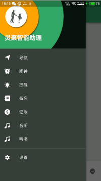
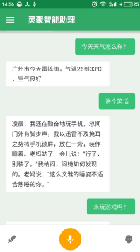
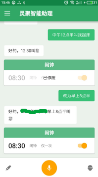
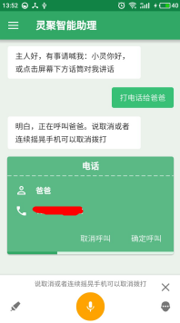
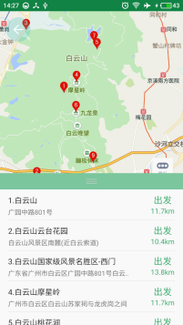
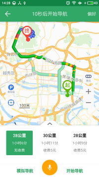
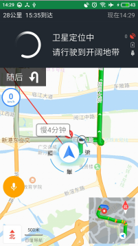
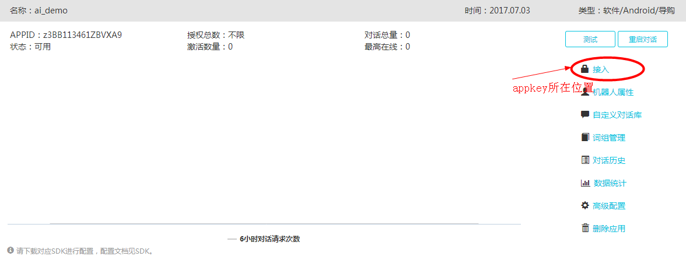

## 灵聚智能助理

* 灵聚APP是包括语义解析、语音交互、智能问答、音乐播放、提醒、记账等多个功能的智能工具类APP。APP集成的灵聚SDK是其核心依赖库。SDK快速的语义解析、覆盖了多个垂直领域的语义通用场景、百亿数量级大数据，并结合语音交互模块，让开发者能快速开发出一款智能语音交互APP。

## 运行截图
 &nbsp;&nbsp;  &nbsp;&nbsp;  

 &nbsp;&nbsp;  &nbsp;&nbsp;  

 &nbsp;&nbsp;  &nbsp;&nbsp;  

## 配置环境及发布
### 开发环境
* 开发平台：Android Studio 2.x&nbsp;&nbsp;&nbsp;&nbsp;Gradle 2.10+
* 运行平台：Android 4.0+
* 开发语言：Java（JDK1.7+）
 

* 由于APP中申请的第三方SDK的appkey与签名文件有关，而APP不提供签名文件，所以开发者需要自定义一份签名文件，并根据该文件重新申请第三方SDK的appkey，替换到项目中。具体操作过程如下：

### 1. 创建签名文件

打开cmd，输入以下指令：

~~~
keytool -genkey -v -keystore {FILENAME.keystore} -alias {ALIAS} -keyalg RSA -validity {DURATION} 

* {FILENAME.keystore} 为生成的KeyStore的文件名
* {ALIAS} 为生成的KeyStore文件的别名
* {DURATION} 为该KeyStore文件的过期时间
~~~

### 2. 修改app/build.gradle里android.signingConfigs.default_config

~~~
android {
    signingConfigs {
        default_config {
            keyAlias '你的keyAlias'
            keyPassword '你的keyPassword'
            storeFile file('你的keystore文件路径')
            storePassword '你的storePassword'
        }
    }
    ...
}
~~~

### 3. 申请第三方SDK的appkey

需要申请appkey的SDK如下：
<table border="0">
  <tr>
    <th>第三方SDK</th>
    <th>appkey申请地址</th>
  </tr>
  <tr>
    <td>灵聚SDK</td>
    <td>http://dev.lingju.ai/</td>
  </tr>
    <tr>
    <td>讯飞语音</td>
    <td>http://www.xfyun.cn/index.php/mycloud/app/create</td>
  </tr>
  <tr>
    <td>百度LBS</td>
    <td>http://lbsyun.baidu.com/apiconsole/key/create</td>
  </tr>
    <tr>
    <td>新浪微博</td>
    <td>http://open.weibo.com/apps/new?sort=mobile</td>
  </tr>
    <tr>
    <td>腾讯QQ</td>
    <td>http://open.qq.com/</td>
  </tr>
    <tr>
    <td>微信</td>
    <td>https://open.weixin.qq.com/</td>
  </tr>
    <tr>
    <td>喜马拉雅（听书）</td>
    <td>http://open.ximalaya.com/</td>
  </tr>
</table>

* 注意：在申请灵聚SDK的appkey时，创建应用后，在该应用右侧的“接入”选项可查看appkey。

### 4. 在项目中替换新申请到的appkey

在app下的com.lingju.assistant.social.weibo.Constants类中修改对应常量参数的值。

~~~
    /** 微博appkey */
    String WEIBO_APPKEY = "你的appkey";

    /** 微信 */
    String WECHAT_APPID = "你的appid";
    String WECHAT_AppSecret = "你的appSecret";

    /** 腾讯qq*/
    String TENCENT_APPID = "你的appid";
    String TENCENT_AppSecret = "你的appSecret";

    /**讯飞语音*/
    String XUNFEI_APPID = "你的appid";

    /**喜马拉雅*/
    String XIMALAYA_APPKEY = "你的appkey";
    String XIMALAYA_APPSECRET = "你的appSecret";
    // 授权回调页，默认使用该URL（在开发平台创建应用时也要填入该URL）
    String XIMALAYA_REDIRECT_URL = "https://api.ximalaya.com/openapi-collector-app/get_access_token";
    
    /** 灵聚SDK*/
    String LINGJU_APPKEY = "你的appkey";
~~~

* 特别的，百度LBS和喜马拉雅的appkey需要在AndroidManifest.xml的application标签下声明：

~~~
<!-- 百度LBS -->
<meta-data
	android:name="com.baidu.lbsapi.API_KEY"
	android:value="你的appkey"/>
<!--喜马拉雅SDK-->
<meta-data
	android:name="app_key"
	android:value="你的appkey"/>
~~~

### 5. 在项目中替换对应的SDK

* 由于讯飞语音应用申请的Appid和对应下载的SDK（包括jar和本地库）具有一致性，SDK不通用。开发者还需要在voicemodule/libs和voicemodule/src/main/jniLibs中替换自己的讯飞SDK。如下图所示：

   

* 另外，项目是使用了灵聚安卓版软件版（不允许在非手机环境下运行）SDK。如果开发者需要开发硬件产品，需要在灵聚开发者平台创建硬件类型应用，并下载硬件版SDK在voicemodule/libs中替换。如下图所示：

   

   然后在AssistantService类的chatRobotInited( )方法的AndroidChatRobotBuilder初始化中加入“授权码”这一参数。
   
   
   
* 在灵聚开发者平台您创建的应用右侧的“接入”选项可查看授权码。
  
   

## 相关文档链接
1. [APP开源说明文档](https://www.kancloud.cn/ljsdk/lingju_app/351356)（必读）
2. [灵聚SDK指令文档](http://doc.lingju.ai/order)

## License 
~~~
Copyright(c) 2017 灵聚科技

Licensed under the Apache License, Version 2.0 (the "License");
you may not use this file except in compliance with the License.
You may obtain a copy of the License at

   http://www.apache.org/licenses/LICENSE-2.0

Unless required by applicable law or agreed to in writing, software
distributed under the License is distributed on an "AS IS" BASIS,
WITHOUT WARRANTIES OR CONDITIONS OF ANY KIND, either express or implied.
See the License for the specific language governing permissions and
limitations under the License.
~~~
